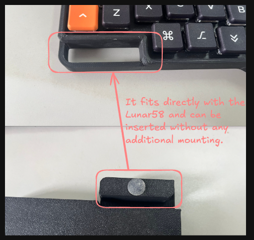

# Lily58_WristRest
Custom 3D-printed wrist rest compatible with the Lily58 split keyboard and Lunar58 case.

### [--> Original lily58 keyboard repository](https://github.com/kata0510/Lily58)
The setup in the photo features a Lily58Pro paired with Kailh Choc V1 low-profile switches.

### [--> Original lunar58 case repository](https://www.thingiverse.com/thing:5386099)
In the picture above, I used the BOTTOM_CASE.stl instead of the BOTTOM_CASE_OPEN.stl (Lunar58 case).

## Wrist Rest for Lily58Pro & Lunar58
This wrist rest was designed to address wrist strain caused by using low-profile switches with the Lunar58 case.

After multiple rounds of real-world 3D printing tests, you can print my model directly without worrying about the stability or compatibility of the insertion parts.

### Note: This model uses PLA matte material to ensure the aesthetic quality of the case.

### Thanks to the authors of [Lily58](https://github.com/kata0510/Lily58), [Lunar58](https://www.thingiverse.com/thing:5386099), and [SofleCase](https://github.com/str-dst/SofleCase) for their work. This project references their repositories. If you find it useful, a star would be greatly appreciated.
